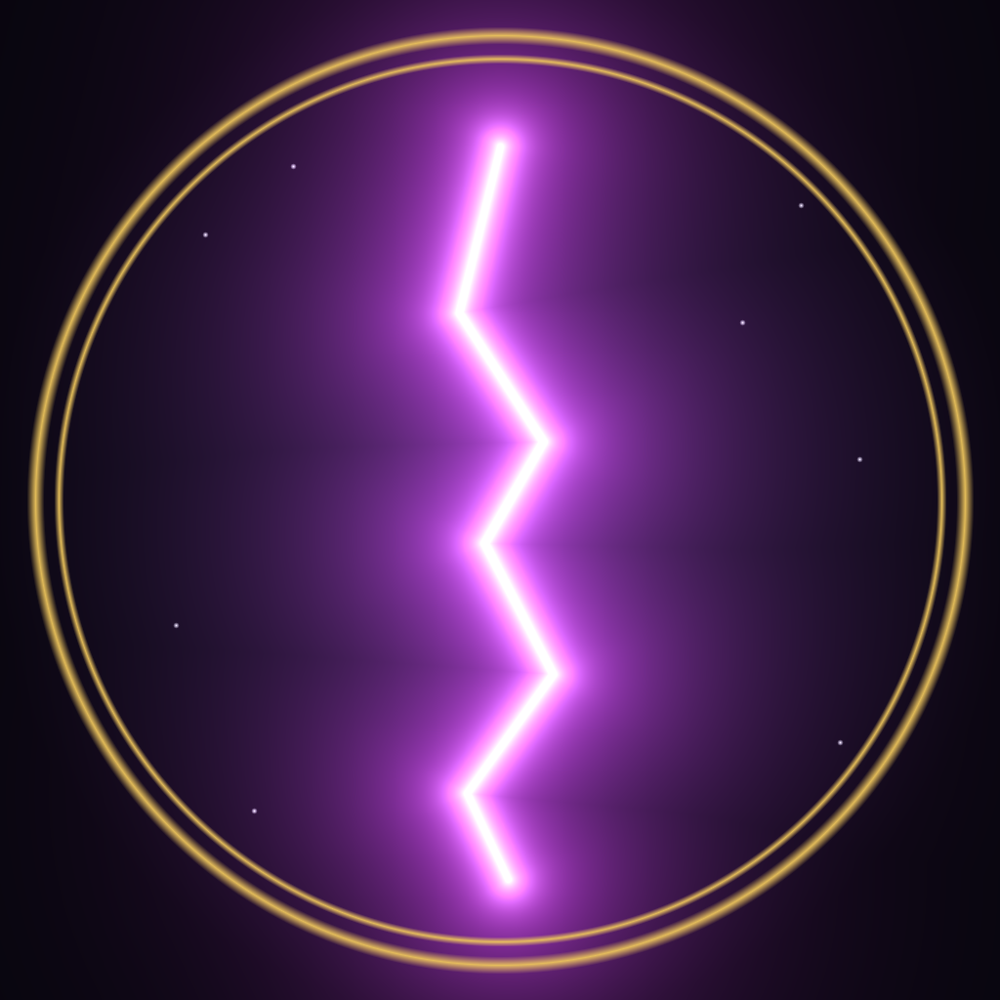

# Lords of Twilight

<p align="center">
  
</p>

<p align="center">
  <a href="https://ko-fi.com/laughinginpurgatory" target="_blank" rel="noopener noreferrer">
    
  </a>
  <br>
  <em>Please support me on Kofi, every bit helps!</em>
</p>

*A tale of the Third Age of Midnight*

A strategy/adventure game in the spirit of Mike Singleton's **Lords of Midnight** and **Doomdark's Revenge** — first-person exploration, a compass, and a realm to rally. This time the enemy isn't Doomdark's army: it's the Abyss itself, pouring through a Rift torn into the world.

It's a **fully self-contained desktop app** built with Electron. It opens in its own window — no browser, no server, nothing else to install. Game code, low-poly **WebGL** world view, textures, models, and music are all bundled inside the app.

Outside the bundle the process only ever touches two plain-text files in your per-user data directory:

| File | Purpose |
|------|---------|
| `highscores.txt` | Top-10 annals |
| `savegame.json` | Single-slot quest save (Continue from the title screen) |

## Play

Grab the installer for your platform from the [GitHub Releases](https://github.com/LaughingInPurgatory/lords-of-twilight/releases) page:

| Platform | File |
|----------|------|
| **Windows** | `Lords of Twilight-<version>-win-x64.exe` (installer) or `…win-x64.zip` (unzip &amp; run `Lords of Twilight.exe`) |
| **macOS** | `Lords of Twilight-<version>-mac-arm64.dmg` (Apple Silicon) or `…mac-x64.dmg` (Intel) |
| **Linux** | `Lords of Twilight-<version>-linux-x86_64.AppImage` (or `…arm64.AppImage`) — `chmod +x` it, then run |

> The builds are **unsigned** (no paid Apple/Microsoft signing certificate).
>
> **macOS:** drag the app to **Applications**, then first launch → right-click the app → **Open** (or *System Settings → Privacy &amp; Security → Open Anyway*). If macOS instead says the app is **"damaged and can't be opened"**, that's the download-quarantine flag on an unsigned app — clear it once with:
> ```bash
> xattr -cr "/Applications/Lords of Twilight.app"
> ```
> then open it normally.
>
> **Windows:** SmartScreen → **More info → Run anyway**.

Scores and saves live per-user (e.g. `~/Library/Application Support/Lords of Twilight/` on macOS, `%APPDATA%\Lords of Twilight\` on Windows), so they survive reinstalls and updates.

The four music tracks (title / gameplay / victory / defeat) are bundled in and play automatically; toggle them with **U** or from **Settings**, and your choice is remembered.

### Graphics

From **v2.3** onward the play view is a low-poly **WebGL** world (Three.js): textured terrain, sky, keeps and villages, and an elaborate **Abyssal Rift** setpiece. **v2.4** adds directional lighting and shadows, a larger **120×88** realm, cinematic camera easing, and a warm dark-fantasy HUD. If WebGL cannot start, the game falls back to the classic 2D canvas panorama automatically.

> **Note:** v2.3.0 release binaries accidentally fell back to 2D because packaging dropped Three's `OBJLoader`. **v2.3.1+** vendors Three under `renderer/vendor/` so the WebGL view ships correctly.

### What’s new in 2.4.1

- Fix Continue quest (v3 saves load correctly; only current-schema saves are offered)
- Default window **1600×900**; size (and maximize) remembered across launches
- **Alt+Enter** / **Option+Enter** toggles fullscreen

### What’s new in 2.4.0

- New application icon (knight vs abyssal champion)
- Larger procedural map (120×88) with save schema **v3**
- WebGL lighting, shadows, taller mountains, smoother camera
- Warm dark-fantasy title / pause / end UI polish
- Clean full quit on macOS (traffic light, ⌘Q, dock Quit, pause Quit)
- Minimal macOS menu (About + Quit only); in-game pause owns Save / Continue

## Run from source / build it yourself

You need Node and (for `npm install` only) network access — Electron downloads its platform binaries.

```bash
npm install            # electron + electron-builder (+ three as a dev dep for re-vendoring)
npm start              # run the game in its own window
npm run icon           # rebuild build/icon.png from icon.jpg (optional)

npm run dist:mac       # → dist/*.dmg (arm64 + x64)
npm run dist:linux     # → dist/*.AppImage
npm run dist:win       # → dist/*.exe (NSIS) + *.zip
npm run dist           # all platforms configured in package.json
```

`npm run dist` builds all three platforms at once. Cross-building the Windows **NSIS installer** from macOS/Linux works because electron-builder ships its own bundled NSIS + Wine; if that ever fails, `npm run dist:win:nowine` produces just the runnable `.exe`-in-a-`.zip`.

The app icon is `build/icon.png` (used by electron-builder for `.icns` / `.ico`). Source art lives at **`icon.jpg`**; `npm run icon` re-keys the checkerboard fringe onto a dark background for packaging.

### Project layout

```
main.js                 Electron main — window, scores + save IPC, clean quit
preload.js              contextBridge (lotScores / lotSave / lotApp)
icon.jpg                source art for the app icon
renderer/
  index.html            shell, CSS, overlays, HUD, import map
  boot.js               loads WebGL view, then game.js (2D fallback if needed)
  world3d.js            low-poly Three.js play view + Rift setpiece
  game.js               world, input, logic, save, HUD, classic 2D fallback
  vendor/               vendored three.module + three.core + OBJLoader
  textures/             terrain / structure / Rift oil textures (CC0)
  models/               crystal spire OBJ for the Rift
  *.mp3                 title / bg / win / ded
scripts/make-icon.js    icon.jpg → build/icon.png (packaging)
build/afterPack.js      macOS ad-hoc codesign after pack
build/icon.png          1024² app / installer icon
```

Three.js is **vendored** into `renderer/vendor/` so electron-builder always packs it (it strips `node_modules/**/examples/**` by default, which would otherwise drop `OBJLoader`). The `three` npm package is a **devDependency** for re-copying those files when upgrading.

## How to Play

### The story

Long after Doomdark fell and the Ice Crown was shattered, a new wound has torn open in the deep east: **the Abyssal Rift**. Creatures of living shadow are pouring out of it, and a purple corruption is spreading across the land, night by night, toward the **Citadel of Dawn**.

You are **Lord Athelorn**, Heir of the Moonprince. Your quest: ride out from the Citadel, rally every free lord still standing, gather a host strong enough to seal the Rift — before the corruption swallows your home, or time runs out.

### The view

You look out across the land in one of eight compass directions (N, NE, E, SE, S, SW, W, NW), in the same spirit as Lords of Midnight. Turn to look around; walk forward to travel one tile in the direction you face. Mountains, forests, keeps, and the baleful Rift render live in the low-poly WebGL world (or the classic silhouette panorama if WebGL is unavailable).

Every world is procedurally generated and different each time you start a new game — mountain ranges, forests, keeps, villages, towers, and the Rift itself are all placed fresh, though the game always guarantees a walkable path exists to everything.

### Controls

The game supports **keyboard, mouse, and gamepad** simultaneously — use whichever you like.

| Action | Keyboard | Mouse | Gamepad |
|---|---|---|---|
| Turn left / right | `←` `→` or `A` `D` | Click left/right third of the view | D-pad / left stick |
| Move forward | `↑` or `W` (also `F`) | Click the centre of the view | D-pad up / left stick up |
| Move back | `↓` or `S` | — | Left stick down |
| Rest until dawn | `R` | REST button | **X** or D-pad down |
| Open/close map | `M` | MAP button | **Y** |
| Next / previous lord | `Tab` or `N` / `Q` | NEXT LORD button | **RB** / **LB** |
| Pause / resume | `Esc` | — | **B** or **Start** |
| Save quest | — | Pause → **Save Quest** | — |
| Continue quest | — | title **Continue Quest** | — |
| Confirm / continue | `Enter` or `Space` | Continue button | **A** |
| Toggle music | `U` | Settings → Music | — |
| Toggle fullscreen | `Alt`+`Enter` (macOS: `Option`+`Enter`) | — | — |
| Annals (intro) | — | **Annals** button | — |

### Exploring & recruiting

As you travel, you'll come across:

- **Keeps, villages, and towers** — visit one and, if a lord is waiting there, they join your cause along with their warriors and riders. Your strength grows every time.
- **Towers** — some hold a seer's vision; visiting one may reveal the Rift's location on your map.
- **Abyssal warbands** — roaming patrols of shadow-creatures. Walking into one triggers a battle. Win, and the horde is destroyed (with losses on your side); lose, and your host is bloodied and driven back.

You can command multiple lords at once — recruit them, then use **Tab** to switch which one you're actively directing. Each lord has their own position, army, and hours of daylight remaining.

Your quest auto-saves as you play; **Continue** on the title screen resumes the last save.

### Time & the corruption

Each day gives you a limited number of hours to act — moving, fighting, and visiting places all cost time. When you run out, **rest (R)** to advance to the next dawn. But resting has a cost too: every night, the corruption spreading from the Rift grows a little wider, and new Abyssal warbands may emerge and prowl the land. The clock is ticking — you have a limited number of days before the corruption reaches the Citadel of Dawn itself.

### Winning & losing

**Victory** — gather a large enough host near the Rift (the game tells you the target — **1500** spears) and step into it. Your combined armies seal the Rift shut for good.

**Defeat** — happens if the corruption reaches and swallows the Citadel of Dawn, if every one of your lords falls in battle, or if you run out of days before sealing the Rift.

Either way, you'll get a chance to carve your name — and your score — into the leaderboard, then ride out again into a brand new, freshly generated realm.

## Credits

- Game design inspired by Mike Singleton's *Lords of Midnight*
- 3D: [three.js](https://threejs.org/) (MIT), vendored under `renderer/vendor/`
- Textures: [ambientCG](https://ambientcg.com/) (CC0) — see `renderer/textures/CREDITS.txt`
- Crystal spire model — see `renderer/models/CREDITS.txt`
